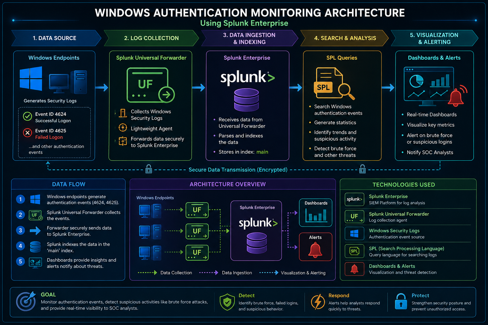
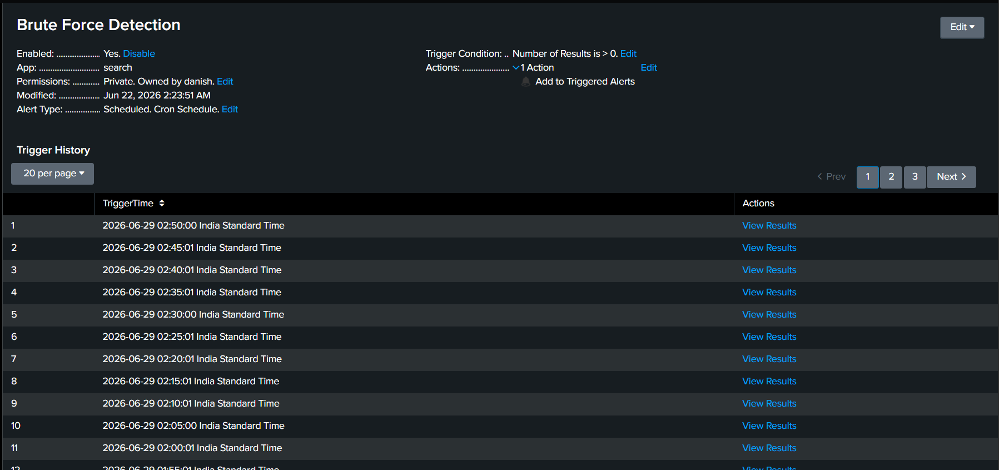

# 🛡️ Windows Authentication Monitoring & Threat Detection using Splunk Enterprise



## 📌 Project Overview

This project demonstrates how **Splunk Enterprise** can be used as a **Security Information and Event Management (SIEM)** platform to monitor Windows authentication events in real time.

Windows Security Event Logs are collected using the **Splunk Universal Forwarder**, indexed by **Splunk Enterprise**, and analyzed using **Search Processing Language (SPL)**. Interactive dashboards and alerts provide visibility into authentication activity, helping detect suspicious events such as failed logins and potential brute-force attacks.

This project simulates a basic **Security Operations Center (SOC)** monitoring workflow and demonstrates practical SIEM implementation skills.

---

## 🎯 Project Objectives

- Monitor Windows authentication events.
- Collect Windows Security Event Logs.
- Detect successful and failed logins.
- Identify suspicious authentication activity.
- Create interactive Splunk dashboards.
- Configure security alerts for brute-force detection.
- Gain hands-on experience with Splunk Enterprise and SPL.

---

# 🏗️ Architecture


### Data Flow

```
Windows Endpoint
        │
        ▼
Splunk Universal Forwarder
        │
        ▼
Splunk Enterprise
        │
        ▼
SPL Queries
        │
        ▼
Dashboards & Alerts
```

---

# ✨ Features

- ✅ Windows Security Log Monitoring
- ✅ Splunk Universal Forwarder Integration
- ✅ Authentication Event Monitoring
- ✅ Successful Login Detection
- ✅ Failed Login Detection
- ✅ Failed Login Trend Analysis
- ✅ Logon Type Distribution
- ✅ Privileged Login Monitoring
- ✅ Brute Force Detection Alert
- ✅ Interactive Dashboard
- ✅ Windows Security Event Analysis

---

# 🛠️ Technologies Used

| Technology | Purpose |
|------------|---------|
| Splunk Enterprise | SIEM Platform |
| Splunk Universal Forwarder | Log Collection |
| Windows Security Logs | Event Source |
| SPL (Search Processing Language) | Log Analysis |
| Windows 11 | Endpoint System |

---

# 📊 Dashboard Panels

The dashboard contains multiple panels that provide real-time visibility into Windows authentication activity.

### 📈 Failed Login Trend

Tracks failed login attempts over time to identify spikes that may indicate brute-force attacks.


---

### 🔐 Privileged Logins

Displays privileged account activity to help identify administrator logins and privileged account usage.


---

### 👤 Top Successful Users

Shows users with the highest number of successful authentication events.


---

### 📊 Logon Type Distribution

Displays authentication events categorized by Windows Logon Type.


---

### 🚨 Brute Force Detection Alert

Splunk alert configured to detect excessive failed login attempts.



---

# 🔍 SPL Queries

## Successful Logins

```spl
index=main EventCode=4624
| stats count
```

---

## Failed Logins

```spl
index=main EventCode=4625
| stats count
```

---

## Failed Login Trend

```spl
index=main EventCode=4625
| timechart count
```

---

## Top Successful Users

```spl
index=main EventCode=4624
| top Account_Name
```

---

## Privileged Logins

```spl
index=main EventCode=4672
| top Account_Name
```

---

## Logon Type Distribution

```spl
index=main EventCode=4624
| stats count by Logon_Type
```

---

## Brute Force Detection

```spl
index=main EventCode=4625
| stats count
| where count > 5
```

---

# 🪟 Windows Security Event IDs

| Event ID | Description |
|----------|-------------|
| 4624 | Successful Login |
| 4625 | Failed Login |
| 4672 | Special Privileges Assigned to New Logon |
| 4740 | User Account Locked Out |

---

# 📁 Repository Structure

```
Windows-Authentication-Monitoring-Splunk/
│
├── README.md
│
├── Architecture/
│   └── Project_Architecture.png
│
├── Documentation/
│   └── Windows_Authentication_Monitoring_Using_Splunk_Enterprise.pdf
│
├── Queries/
│   └── spl_queries.md
│
└── Screenshots/
    ├── Brute_Force_Detection_Alert.png
    ├── Failed_Login_Trend.png
    ├── Logon_Type_Distribution.png
    ├── Privileged_Logins.png
    └── Top_Successful_Users.png
```

---

# 📄 Documentation

Complete project documentation is available here:

📘 **Windows Authentication Monitoring Using Splunk Enterprise**

➡️ Documentation/Windows_Authentication_Monitoring_Using_Splunk_Enterprise.pdf

The documentation includes:

- Project Overview
- Lab Setup
- Splunk Installation
- Universal Forwarder Configuration
- Windows Event IDs
- SPL Queries
- Dashboard Creation
- Alert Configuration
- Troubleshooting
- Testing
- Skills Learned
- Conclusion

---

# 📚 Skills Demonstrated

- Splunk Enterprise Administration
- SIEM Fundamentals
- Windows Event Log Analysis
- Authentication Monitoring
- Search Processing Language (SPL)
- Dashboard Development
- Alert Configuration
- Security Monitoring
- Log Collection
- Basic Incident Investigation
- Troubleshooting

---

# 🚀 Future Enhancements

- Sysmon Integration
- Active Directory Monitoring
- Microsoft Sentinel Integration
- MITRE ATT&CK Mapping
- Email Alert Notifications
- Threat Intelligence Integration
- Advanced Threat Hunting Dashboards

---

# 👨‍💻 Author

**Danish Mansuri**

**MCA (Cyber Security & Digital Forensics)**

Cyber Security Enthusiast | SOC Analyst Aspirant

**GitHub**

https://github.com/danishMansuri488

**LinkedIn**

https://www.linkedin.com/in/YOUR-LINKEDIN-USERNAME/

---

# ⭐ If you found this project useful

Please consider giving this repository a ⭐ on GitHub.
